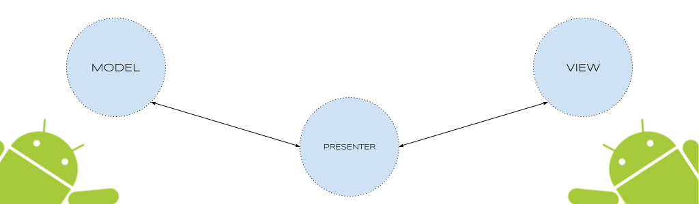

# android-mvp

## Android MVP
 

Ejemplo de como implementar el Patrón MVP ( Model- View - Presenter) en Android

 

## Ejemplo :

 
 

## Postman :

 
 
 
 

## Tools :

 - Android Parcelable code generator plugin for Android Studio
   * https://plugins.jetbrains.com/plugin/7332?pr=idea

## Updates :

- [08-04-17] Actualización de versión de Retrofit a 2.0

## Dependencias :

- Retrofit 2.1.0 [http://square.github.io/retrofit/](http://square.github.io/retrofit/)

- Gson 2.1.0 [https://github.com/google/gson](https://github.com/google/gson)

- okHttp 3.3.1 [http://square.github.io/okhttp/](http://square.github.io/okhttp/)

## Referencias :

 - Retrofit
   * https://futurestud.io/tutorials/retrofit-getting-started-and-android-client
   * https://square.github.io/retrofit/

## Issues

- Cualquier issue, duda o consulta lo puede dejar en este link [https://github.com/emedinaa/android-maven/issues](https://github.com/emedinaa/android-maven/issues) y lo atenderé a la brevedad.
